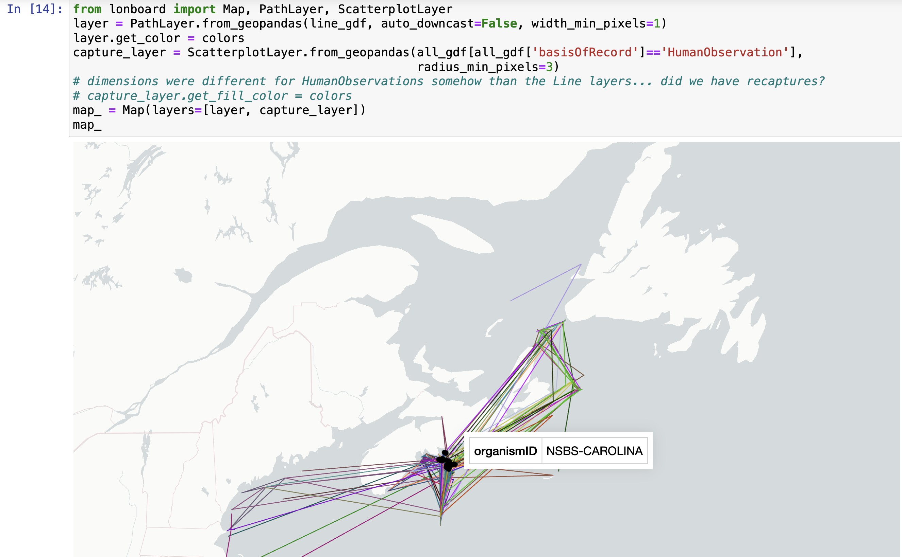
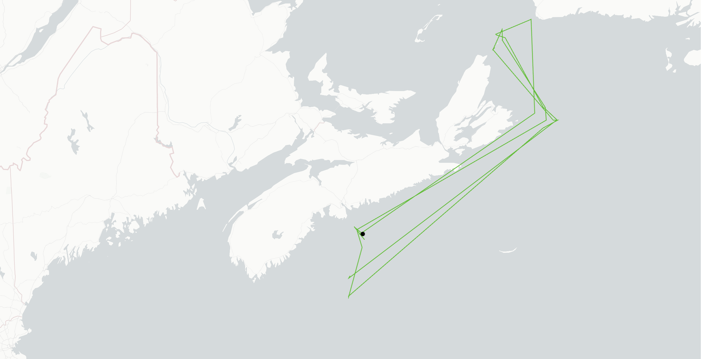

# lonsnapper
using lonboard to snap animal tracking data in Darwin Core archives to deck.gl maps.

OTN makes Darwin Core archives that follow the same individual animal along a path over time, observed either through acoustic tags or satellite tags or other novel methods of identifying an individual in many places over time. This is a simple visual inspection flow that verifies these archives and shows the user the paths contained in them.

I am using a relatively new Python module, [lonboard](https://developmentseed.org/lonboard), to organize and serve the geospatial data efficiently, and avoid overwhelming the plotting engine when detection counts get into the millions. In this way, we can explore all of the paths at once.

We can also isolate a single path over time.

More features to come as I work them out.